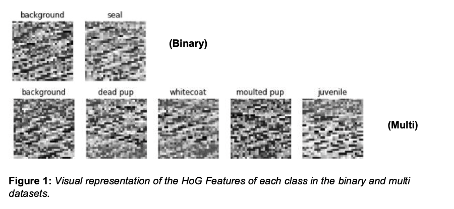
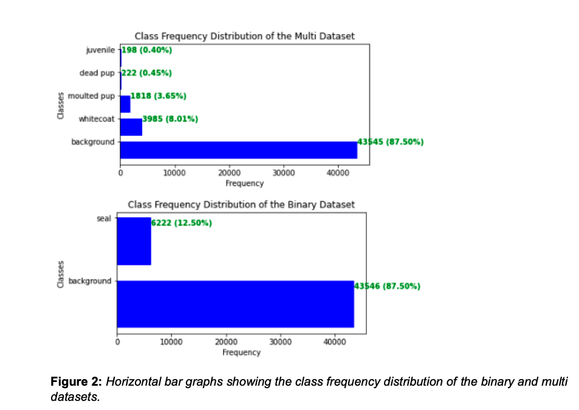
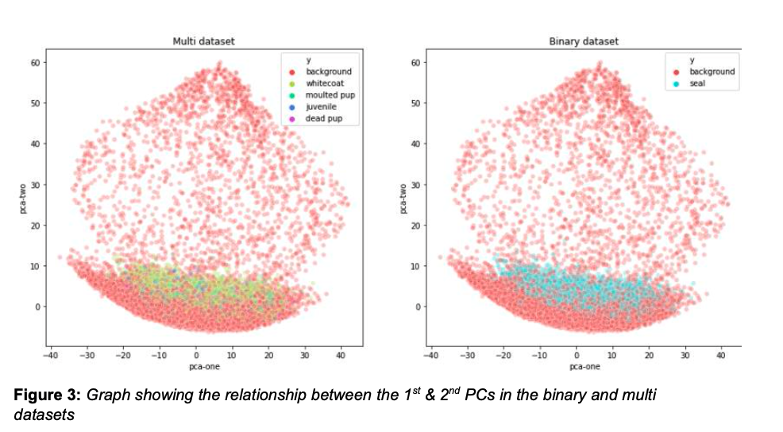
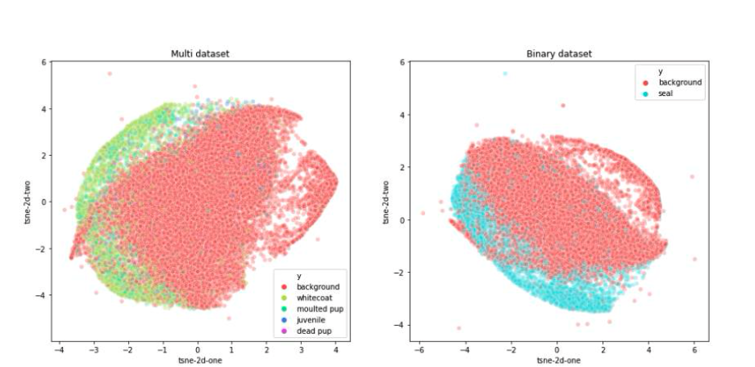
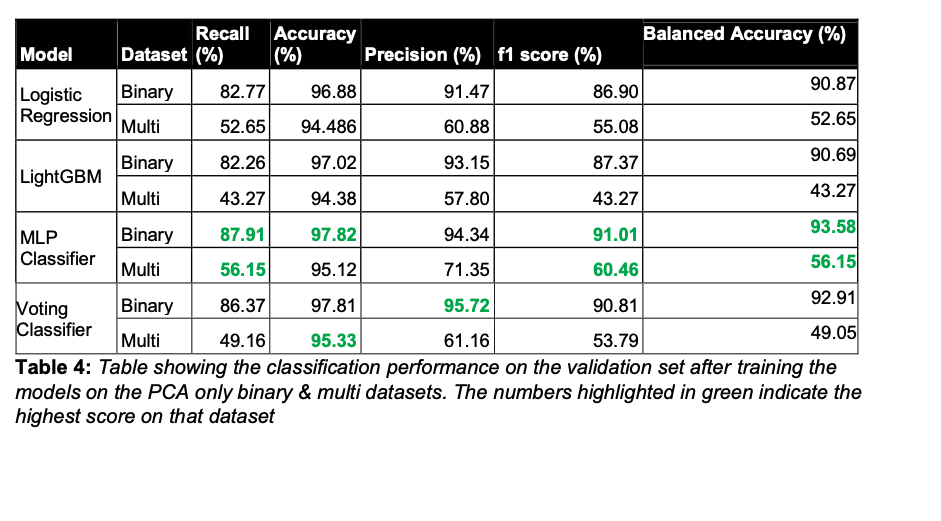
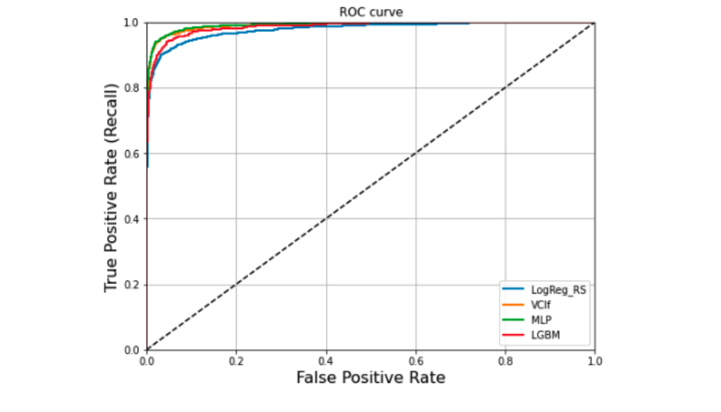
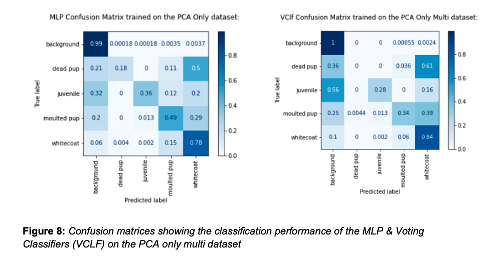

# Classification of Seal Images

Full report can be found [here](Practical-2-Classification-of-Seal-Images-Report.final.pdf)

## Introduction

Monitoring seals and their different stages of development can be very useful for institutions that are concerned about species preservation and climate change. However, manually sifting through months of data can be time-consuming and labour intensive. Moreover, classifying aquatic animals poses several challenges such as background noise, distortion of images, the presence of other water bodies in images and occlusion. Lastly, real-world datasets often have issues with data imbalance [2], which creates a challenge for machine learning models as most algorithms are designed to maximise accuracy and reduce the error.

Interestingly, with the developments in machine learning and image feature extraction, seal classification can be automated. Additionally, sampling strategies, such as over- and undersampling, are extremely popular in tackling the problem of clas.s imbalance where either the minority class is oversampled, the majority class is undersampled or a combination of the two . Consequently, the practice of combining multiple models to form an ensemble has been shown to address the weaknesses of individual models, thus creating a greater single model overall. This study trains several machine learning models with different resampling techniques, to classify seals from imbalanced datasets of features extracted from images.

## Dataset
To gain some visual intuition of the Histogram of Orientated Gradient (HOG) features, I sliced the first 900 columns and picked an image from each class found in the Y_train datasets (see Figure1). Despite the images being in very low resolution, there are still some visual differences between each class. For instance, the whitecoat image has less dark pixels when compared to the moulted pup. Observing the visual differences between the classes can also be useful for trying to get an intuitive understanding of why a classifier misclassifies a particular class.

## Visualising the dataset
### Class Distribution

I discovered that the data was heavily imbalanced after I visualised the frequency distribution of the classes (see Figure 2). From Fig. 2, it is evident that both datasets are heavily skewed towards the background class, where it accounts for 87.5% of the entries in both datasets. In contrast, the juvenile and dead pup classes account for 0.40% and 0.45% respectively, highlighting a high class imbalance when compared to the background class.

### PCA and t-SNE visualisations

Given the high-dimensional nature of the dataset (964 features), it made sense to implement dimensionality reduction in order to visually explore the whole dataset. The techniques implemented in this study were PCA (Principal Component Analysis) and t-SNE (t-Distributed Stochastic Neighbouring Entities).

#### PCA

#### t-SNE

## Results

After picking the top-performing models, I evaluated their performance on the validation set. The MLP classifier was the top-performing model on the binary dataset; where it had an accuracy of 97.82% and a balanced accuracy of 93.58%. The voting classifier came in very close in 2nd place, with an accuracy of 97.79% and balanced accuracy of 92.9%. It also had the highest precision, suggesting that ensembling helped to improve the ratio of true positives and false positives. From the receiver operating characteristic (ROC) curve below (see Figure 7) one can visually see how the MLP classifier has a higher true positive rate and larger area under the curve than the other classifiers.

On the multi-dataset, the results were more interesting. The MLP classifier performed the best in terms of recall, f1 score and balanced accuracy (see Table 4), however, the Voting classifier had a higher accuracy overall (95.33% vs 95.12%). From the confusion matrices (see Figure 8), we can see that combining the models did help classify the background and the whitecoat classes better than the MLP alone. However, the MLP classifier was able to predict the moulted pup, juvenile and dead pup classes far better than the voting classifier. Since the voting classifier votes ‘softly’ by returning the class label with the highest average probability, LightGBM and Logistic regression may have had much weaker predictions for the moulted pup, juvenile and dead pup classes than the MLP classifier, dragging down the weighted average probability and causing the voting classifier to predict them poorly. Therefore, for the voting classifier to have better predictions on all classes than the rest of the models, models should be combined in a way to increase the weighted average of probabilities. Nonetheless, the voting classifier achieved a higher accuracy overall on the multi dataset, hence there are some merits to its performance.

